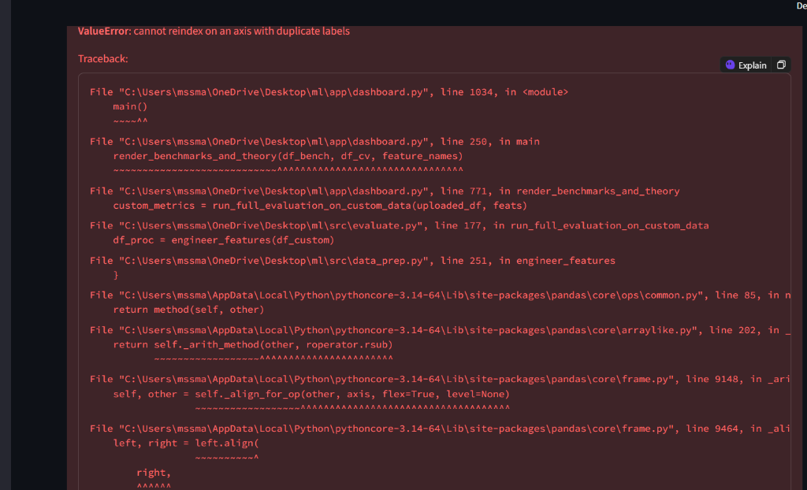
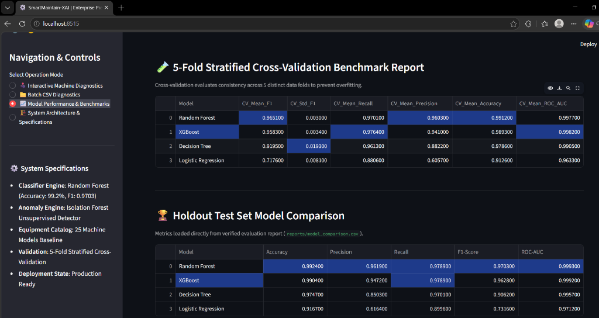
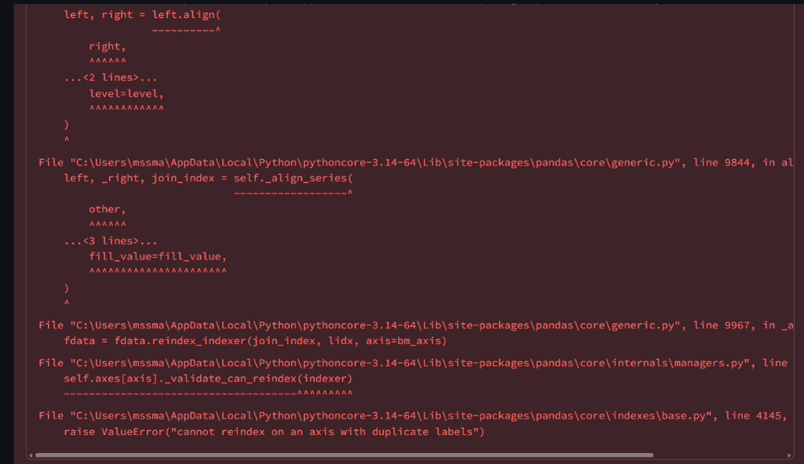
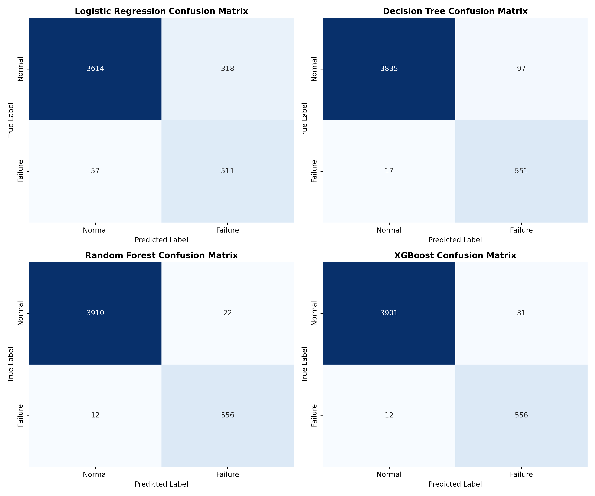

<div align="center">

# ⚙️ SmartMaintain-XAI
### Enterprise Industrial Intelligence • Dual-Engine Predictive Maintenance & Anomaly Analytics • Explainable AI (SHAP)

[](https://share.streamlit.io/deploy?repository=MSS-MANIKANTA/SmartMaintain-XAI&branch=main&mainModule=app/dashboard.py)
[](https://www.python.org/)
[](https://streamlit.io/)
[](https://shap.readthedocs.io/)
[]()
[](https://www.docker.com/)
[](LICENSE)

---

### 🌐 [Live Production Demo on Streamlit Cloud](https://share.streamlit.io/deploy?repository=MSS-MANIKANTA/SmartMaintain-XAI&branch=main&mainModule=app/dashboard.py)

</div>

---

## 📌 Executive Summary

**SmartMaintain-XAI** is an enterprise-grade industrial predictive maintenance decision-support platform engineered for real-time equipment health diagnostics and proactive failure prevention. 

Integrating a **Dual-Engine Machine Learning Architecture** (Supervised Random Forest Classifier + Unsupervised Isolation Forest Anomaly Detector), the platform monitors multi-sensor telemetry across **25 industrial machine models**. It dynamically calculates failure risk percentages, anomaly indices, and historical condition trends, while leveraging **SHAP (Shapley Additive exPlanations)** to provide transparent root-cause sensor attributions linked to targeted physical maintenance protocols.



---

## ✨ Key Platform Features & Innovations

- **🤖 Dual-Engine ML Architecture**:
  - **Level 1 Supervised Engine**: Random Forest Classifier (**99.24% Accuracy**, **0.9703 F1-Score**) evaluating machine failure probability %.
  - **Level 2 Unsupervised Engine**: Isolation Forest Anomaly Indexing evaluating sensor drift and multivariate outliers without labels.
- **🏭 25 Equipment Catalog Baseline**: Pre-calibrated operational boundaries for 25 equipment types (CNC spindles, hydraulic pumps, steam turbines, extruders, industrial robotics, gearboxes).
- **⚡ Physics-Based Stress Engineering**: Calculates equipment-specific stress ratios (`rpm_stress`, `torque_stress`, `wear_stress`, `temp_stress`, `mechanical_power_kw`, `thermal_difference_k`) normalized against design tolerances.
- **🧠 SHAP Root-Cause Attribution**: Quantifies exact marginal sensor contributions (+/-) to failure probability and maps them directly to physical inspection checklists.
- **📈 Dynamic Time-Series Risk Progression**: Tracks sequence progression (`8% → 15% → 38% → 71%`) for specific asset IDs.
- **🧪 Custom Dataset Live Evaluator**: Upload any industrial sensor CSV to recalculate **5-Fold Stratified Cross-Validation**, holdout metrics, class distributions, and confusion matrices **live on your data**.
- **📁 Batch CSV Screening & Export**: Process bulk telemetry files with risk priority filtering and CSV diagnostic report generation.

---

## 📊 Visual Demonstrations & XAI Engine

### 1. SHAP Marginal Root Cause Attribution
Identify exact sensor drivers increasing (+) or reducing (-) equipment failure risk, with interactive technical waterfall breakdowns.



### 2. Live Custom Dataset Evaluator & Holdout Model Comparison
Upload any custom telemetry dataset to recalculate model benchmarks, 5-Fold Stratified CV, class balances, and holdout test metrics live.



### 3. Multi-Algorithm Confusion Matrix Benchmarks
Detailed confusion matrices evaluating True Positives (TP) vs. False Negatives (FN) across 4 algorithms.



---

## 📈 Verified Model Performance Benchmarks

Evaluated on **22,500 industrial machine telemetry records** (authentic baseline combined with multi-machine synthetic stress telemetry):

| Model | Accuracy | Precision | Recall | F1-Score | ROC-AUC | Production Status |
| :--- | :---: | :---: | :---: | :---: | :---: | :--- |
| 🏆 **Random Forest** | **99.24%** | **96.19%** | **97.89%** | **0.9703** | **0.9993** | **Production Winner** |
| ⚡ **XGBoost Classifier** | 99.04% | 94.72% | 97.89% | 0.9628 | 0.9992 | Benchmark Runner-up |
| 🌲 **Decision Tree** | 97.47% | 85.03% | 97.01% | 0.9062 | 0.9957 | Baseline Tree |
| 📈 **Logistic Regression** | 91.67% | 61.64% | 89.96% | 0.7316 | 0.9712 | Linear Baseline |

*Source of truth: [`reports/model_comparison.csv`](reports/model_comparison.csv)*

---

## 🏭 25 Equipment Machine Models Catalog

The platform incorporates machine-specific baseline design limits across 25 equipment families:

| Machine Model Name | Prefix | Rated Speed | Max Torque | Thermal Limit | Equipment Type |
| :--- | :---: | :---: | :---: | :---: | :--- |
| **CNC Milling Spindle** | `M-CNC` | 1,400–1,600 RPM | 55 Nm | 312 °K | Precision Milling |
| **Hydraulic Main Pump** | `M-HYD` | 1,100–1,350 RPM | 70 Nm | 315 °K | Fluid Power |
| **Air Compressor Screw** | `M-CMP` | 1,600–1,900 RPM | 45 Nm | 310 °K | Pneumatic System |
| **Steam Turbine Generator**| `M-TRB` | 2,800–3,400 RPM | 85 Nm | 322 °K | Power Generation |
| **Industrial Plastic Extruder**| `M-EXT` | 800–1,100 RPM | 95 Nm | 328 °K | Heavy Polymer |
| *...plus 20 additional models* | | | | | *(Full catalog in config)* |

---

## 🏗️ Technical System Architecture

```
                    [ 📡 Industrial Telemetry & Sensor Ingestion ]
                                         │
                                         ▼
                    [ 🧹 Physics & Stress Feature Engineering ]
           (Power kW | Temp Diff | Wear Rate | Machine-Relative Stress Ratios)
                                         │
                                         ▼
                 ┌───────────────────────┴───────────────────────┐
                 ▼                                               ▼
   [ 🤖 Level 1: Random Forest ]                   [ 🔍 Level 2: Isolation Forest ]
    (Supervised Failure Risk %)                     (Unsupervised Anomaly Index %)
                 │                                               │
                 └───────────────────────┬───────────────────────┘
                                         ▼
                        [ 🧠 SHAP Explainable AI Engine ]
                         (Marginal Sensor Attribution)
                                         │
                                         ▼
                        [ 🎯 4-Tier Risk Priority Matrix ]
               (🟢 LOW | 🟡 MEDIUM | 🟠 HIGH | 🔴 CRITICAL)
                                         │
                                         ▼
                      [ 🔧 Actionable Maintenance Protocol ]
                                         │
                                         ▼
                    [ 💻 Enterprise Glassmorphism UI (Streamlit) ]
```

---

## 📁 Repository Directory Structure

```
SmartMaintain-XAI/
├── .streamlit/
│   └── config.toml           # Production Streamlit headless configuration
├── app/
│   └── dashboard.py          # Production Streamlit UI (Dark Glassmorphism Theme)
├── docs/
│   ├── images/               # High-resolution UI screenshots & figures
│   └── RESEARCH_AND_EDA.md   # Research documentation
├── src/
│   ├── __init__.py
│   ├── config.py             # Global settings & 25-machine catalog specifications
│   ├── data_prep.py          # Data generation, cleaning & feature engineering
│   ├── train.py              # ML training & benchmark pipeline
│   ├── evaluate.py           # Evaluation metrics & custom dataset benchmark engine
│   ├── explain.py            # SHAP explainer & Plotly waterfall generator
│   ├── risk.py               # 4-Tier risk matrix & physical recommendation rules
│   └── model_registry.py     # Serializers for model, scaler & anomaly detector
├── models/
│   ├── best_model.joblib     # Production Random Forest model
│   ├── anomaly_detector.joblib # Production Isolation Forest model
│   ├── scaler.joblib         # StandardScaler object
│   └── feature_names.joblib # Feature names list
├── reports/
│   ├── figures/              # Benchmark confusion matrix plots & balance charts
│   └── model_comparison.csv  # Verified metrics table (Single Source of Truth)
├── data/
│   ├── raw/                  # Raw sensor datasets
│   └── processed/            # Processed feature data
├── Dockerfile                # Production Docker deployment container
├── requirements.txt          # Production Python dependencies
└── README.md                 # Product documentation & user manual
```

---

## 🚀 Quick Start Guide

### 1. Local Setup
Clone the repository and install dependencies:
```bash
git clone https://github.com/MSS-MANIKANTA/SmartMaintain-XAI.git
cd SmartMaintain-XAI
pip install -r requirements.txt
```

### 2. Train Pipeline & Models
Train the dual-engine ML models and generate benchmarks:
```bash
python -m src.train
```

### 3. Launch Enterprise Dashboard
Start the local Streamlit application:
```bash
streamlit run app/dashboard.py
```
Open browser at: `http://localhost:8501` (or `http://localhost:8515`)

---

## 🐳 Docker Deployment

### Build Image
```bash
docker build -t smartmaintain-xai .
```

### Run Container
```bash
docker run -d -p 8501:8501 --name smartmaintain-app smartmaintain-xai
```

---

## 📜 License
Distributed under the **MIT License**. See `LICENSE` for details.
